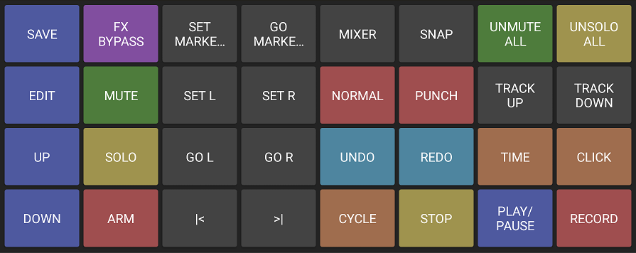

# ARMC2560 Controller

USB MIDI controller for `Arduino MEGA 2560`.

## Specifications

- **Miminu Controller** is a DIY 32 button MIDI controller project for **Arduino MEGA 2560**.
- It has two selectable modes: **CC MODE** and **NOTE MODE**. So depending on the mode selected can send MIDI control changes or MIDI notes.
- It has 4 dedicated buttons to edit the device options, and 28 buttons to send MIDI. This 28 MIDI butttons can be set to send *CC data* or *MIDI notes* depending on the mode of the device.
- The **default channel** is 16. It can be edited, so it can be set any of the 16 MIDI channels, from 1 to 16.
- The **default note range** is from MIDI note 48 to MIDI note 75 (from C2 to Eb4). This can be edited in steps of 12 semitones up or down. The transposition can be set from -3 to +3 octaves.
- The **control changes** are assigned into the 28 buttons from CC0 to CC27.
- It has a built in display with information about the mode, the channel and the transposition.

## Edit Menu

The menu of the device has 4 dedicated buttons. The actions for this buttons are:

1. **Mode**. Selects between **CC MODE** and **NOTE MODE**.
2. **Up**. In *CC MODE*, it increments the MIDI channel. In *NOTE MODE*, it transposes up the MIDI notes in increments of 12 semitones (octaves).
3. **Down**. In *CC MODE*, it decrements the MIDI channel. In *NOTE MODE*, it transposes down the MIDI notes in increments of 12 semitones (octaves).
4. **Save**. Saves the settings changes to the device internal memory (**EEPROM**).

## Keyboard (MIDI buttons)

It has 28 buttons dedicated to MIDI. This buttons can send *CC data* or *MIDI notes* depending on the current mode of the device.

- In **CC MODE** the buttons send MIDI control changes from CC0 to CC27.
- In **NOTE MODE** the buttons send MIDI notes from MIDI note 48 to MIDI note 75 (from C2 to Eb4). This can be transposed up or down in 12 semitones steps (octaves).

### Keyboard

### Reaper mapping

## License
    Copyright 2018 Esteban Latre

    Licensed under the Apache License, Version 2.0 (the "License");
    you may not use this file except in compliance with the License.
    You may obtain a copy of the License at

        http://www.apache.org/licenses/LICENSE-2.0

    Unless required by applicable law or agreed to in writing, software
    distributed under the License is distributed on an "AS IS" BASIS,
    WITHOUT WARRANTIES OR CONDITIONS OF ANY KIND, either express or implied.
    See the License for the specific language governing permissions and
    limitations under the License.
